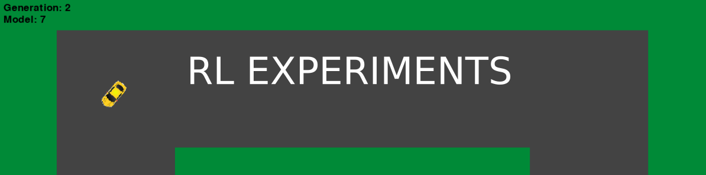

	

	<i>A project utilising genetic algorithms and reinforcement learning for controlling a car model</i>

### Project Motivation

Reinforcement learning is a cyclic process in which there commonly exist an environment and an agent.

The environment models the physical behaviour of whatever it is that is being controlled. In this project this happens to be a car on a race track. The agent is what causes the state of the environment to change according to defined logic.

	

Often times, reinforcement learning is applied to video games or custom simulations for a number of reasons: The environment is easy to reproduce, very cheap to run (in contrast to a real world car driving on the road, crashing into objects) and it can model real world problem - such as performing obstacle avoidance and racing down a race track.

It is easy to see that a rather simplistic model such as the one developed in this project could (with a lot of work) be extended to the real world with real sensor data. Of course this would introduce other issues such as sensor error and control errors, to name a few. However, these could be modelled as well using something like Markov Chains for example.

### Genetic Algorithm

In this project a very specific type of a reinforcement agent is used - a genetic algorithm. It loosely models the process of natural selection. 

	

An initial generation is initialised randomly. This generation's fitness is calculated based on how it performs in the environment. Next, in this project the selection of the next generation is done probabilistically, so that even very unfit models have a chance (though be it a very small one) to survive. Then the models are mated to produce offspring, which entails taking pre-defined parts from each parent to make a new model and finally each offspring is also mutated in a probabilistic manner. The whole process starts over again with the offspring as the current population.

- [x] Build racecar environment
- [x] Build genetic algorithm (still need to add cross-population)

### Future Extensions	

- [ ] Use pixel data instead of "sensor data" for algorithm
- [ ] Try more standard Rl approaches for agent
- [ ] Try some hybrid of GA and Q-Learning/Policy Learning
- [ ] Compare agents

Date: 21/07/2020
