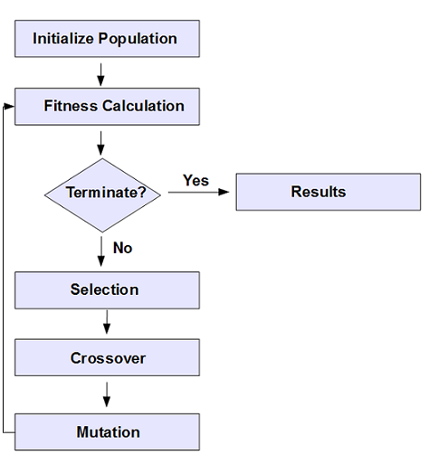

# RL EXPERIMENTS

An attempt at utilising reinforcement learning (RL) for a simple 2D game.
_______________________________

##  test_env and test_agent

- [x] Simple game written as environment (Input: [Action], Output: [State, Reward])
- [x] Simple agent based on Q-Learning with Experience Replay
_______________________________

## TODO: racecar_env and racecar_agent

- [x] Make basic racecar environment
- [ ] Make simple agent. Current plan is to use a genetic algorithm
- [ ] Train agent -> Plot results

